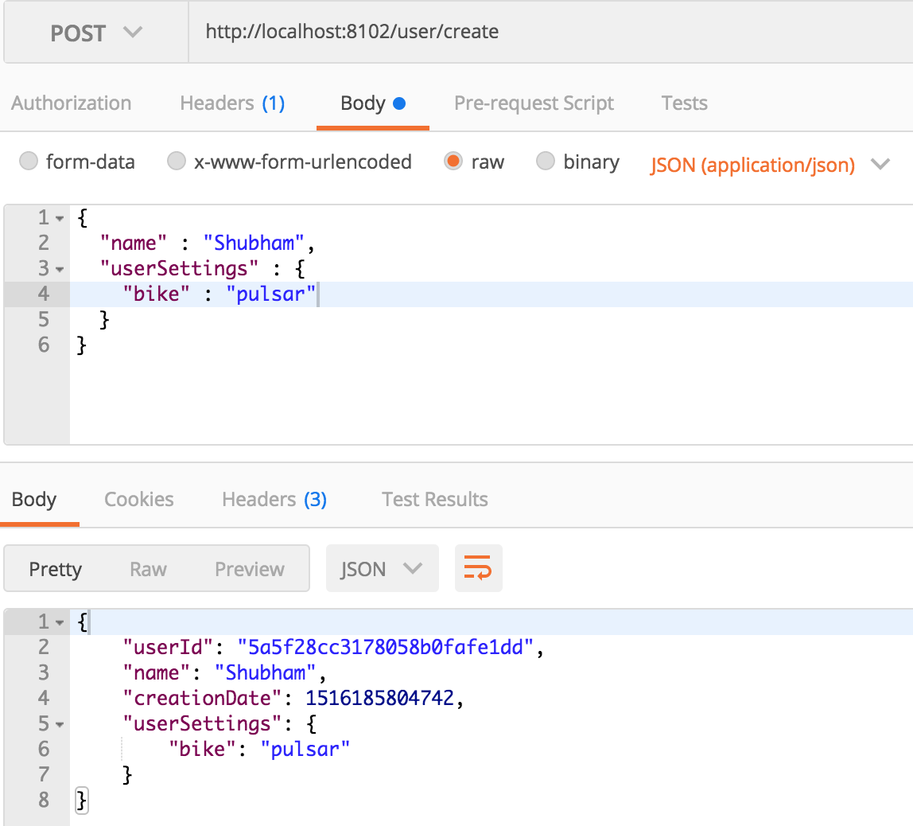
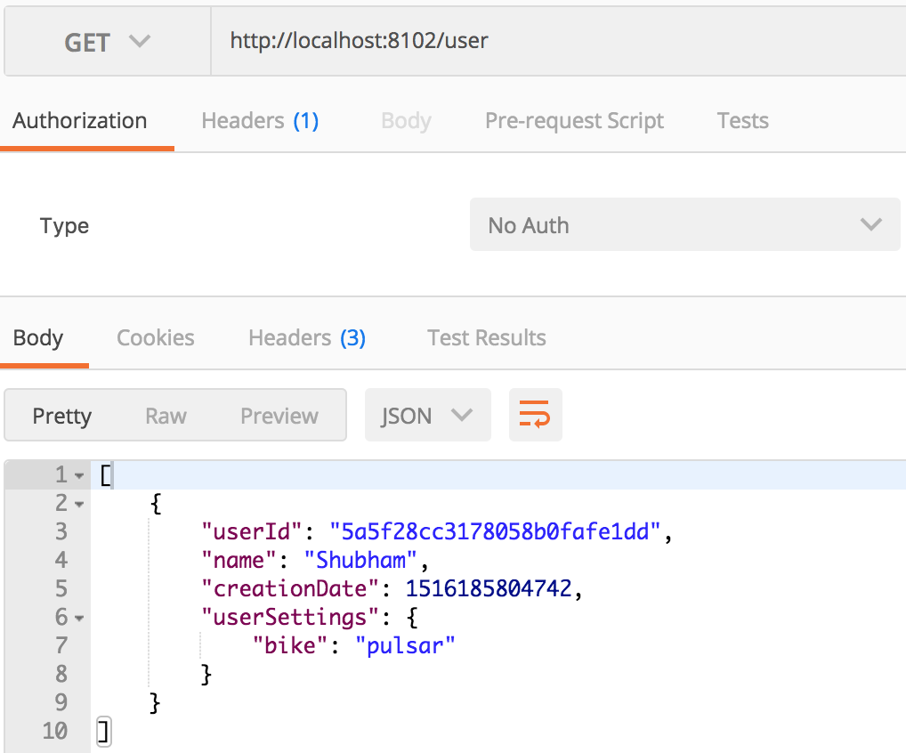

Spring Boot MongoDB
---

* https://www.journaldev.com/18156/spring-boot-mongodb





```text
spring.data.mongodb.host=localhost
spring.data.mongodb.port=27017
spring.data.mongodb.database=test
spring.data.mongodb.authentication-database=test
spring.data.mongodb.username=admin
spring.data.mongodb.password=1978
# collection = "users3"
```

* [POST] http://localhost:8102/user/create
```json
{
  "name" : "Shubham",
  "userSettings" : {
    "bike" : "pulsar"
  }
}
```

* [GET] http://localhost:8102/user


