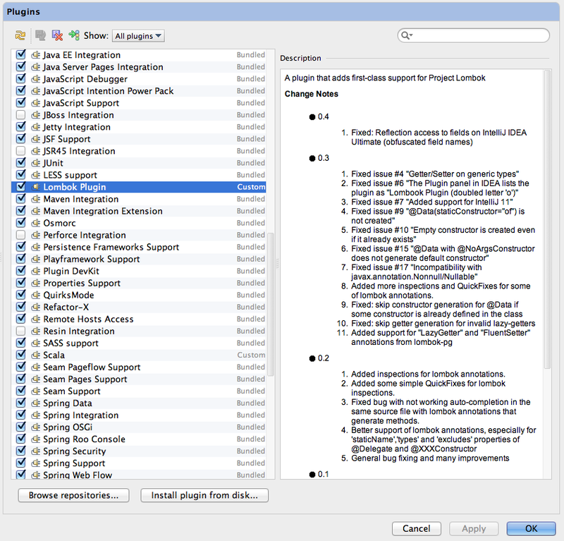
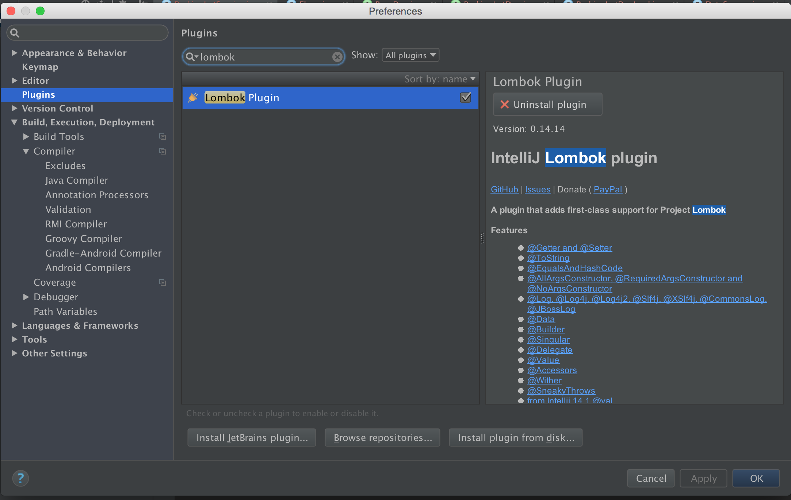
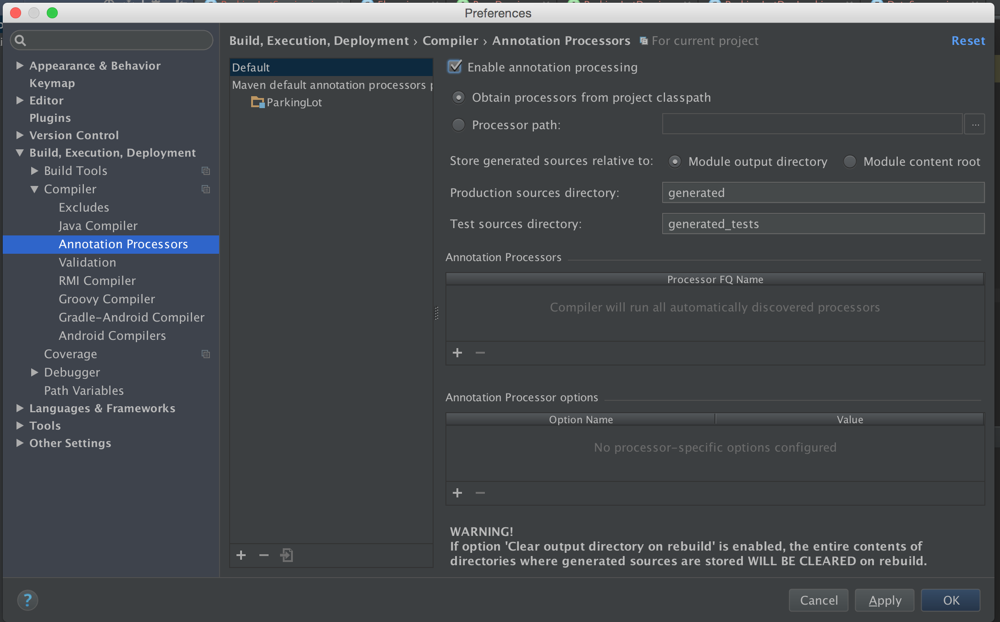

Spring на практике - Как настроить Spring Security в Spring Boot (`Онлайн-курс от GrabDuck.com`)
---

* http://www.artismusik.tk/unduh/mp3/spring-на-практике-как-настроить-spring-security-в-spring-boot.kTjPh8Yp9qT.html
* `Source` https://www.youtube.com/watch?v=Tq9pY8hPjTk  ( https://www.youtube.com/watch?v=3UOc3NTYHiI )
* `Исходники` https://github.com/esurovtsev/spring-security-demo/tree/001-basic-configuration


[28. Security](https://docs.spring.io/spring-boot/docs/1.4.2.RELEASE/reference/htmlsingle/#boot-features-security)

* При подключении модуля security в Spring-е происходит несколько вещей:
  1. Загружается менеджер аудитентификации (по умолчанию в память)
     с именем: `user`
     и паролем который генерится системой при старте: `ae0b9529-8865-478e-8476-7fa18051e9f0`
     По умолчание назначается базовая аудитенфикация (при выполнении каждого запроса в теле запроса хранится информация: имя пользователя и пароль).
     Но другие адресса остаются открытыми (/css/**, /js/**, /images/**, /webjars/** and **/favicon.ico).

Настройки который используются по умолчанию
```text
# ----------------------------------------
# SECURITY PROPERTIES
# ----------------------------------------
# SECURITY (SecurityProperties)
security.basic.authorize-mode=role # Security authorize mode to apply.
security.basic.enabled=true # Enable basic authentication.
security.basic.path=/** # Comma-separated list of paths to secure.
security.basic.realm=Spring # HTTP basic realm name.
security.enable-csrf=false # Enable Cross Site Request Forgery support.
security.filter-order=0 # Security filter chain order.
security.filter-dispatcher-types=ASYNC, FORWARD, INCLUDE, REQUEST # Security filter chain dispatcher types.
security.headers.cache=true # Enable cache control HTTP headers.
security.headers.content-type=true # Enable "X-Content-Type-Options" header.
security.headers.frame=true # Enable "X-Frame-Options" header.
security.headers.hsts= # HTTP Strict Transport Security (HSTS) mode (none, domain, all).
security.headers.xss=true # Enable cross site scripting (XSS) protection.
security.ignored= # Comma-separated list of paths to exclude from the default secured paths.
security.require-ssl=false # Enable secure channel for all requests.
security.sessions=stateless # Session creation policy (always, never, if_required, stateless).
security.user.name=user # Default user name.
security.user.password= # Password for the default user name. A random password is logged on startup by default.
security.user.role=USER # Granted roles for the default user name.
```


1. [Spring на практике - Виды авторизации и как ее настроить в Spring Security](https://www.youtube.com/watch?v=3UOc3NTYHiI)
2. [Spring на практике - как настроить свой UserService в Spring Security](https://www.youtube.com/watch?v=mX2kovQUQAo)

```text
http://localhost:8090
http://localhost:8090/login
http://localhost:8090/login?logout
http://localhost:8090/login?error
```








- По умолчанию Spring использует (свою встроенную) базу данных `HSQL` в памяти системы...

- В нашей задаче мы используем специфический тип-класса `User`.
  Дело в том, что для реляционной базы данных нужно явно создавать таблицы (это в том случае когда мы используем `ORM` (например `hibernate`))...
  Но в этом примере мы ленивые и НЕхотим ничего лишнего подключать и писать..., поэтому (вместо реляционной базы данных) здесь используем `MongoDB` - она позволяет автоматически создавать любую структуру документа в своих коллекциях
```properties
#Local MongoDB config
spring.data.mongodb.host=localhost
spring.data.mongodb.port=27017
spring.data.mongodb.database=test
# Если ваша база данных MongoDB с аудитенфикацией - тогда добавить три строки в вашу конфигурацию:
spring.data.mongodb.authentication-database=test
spring.data.mongodb.username=admin
spring.data.mongodb.password=1978
```
```text

# collection = "users2"
```

- (По какой-то причине Spring-ый файл-конфигурации `YML` здесь НЕработает для базы данных MongoDB с аудитенфикацией...)
