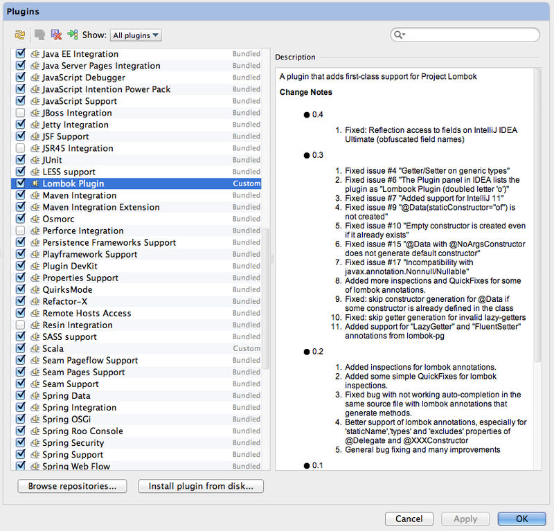

Spring на практике - Как настроить Spring Security в Spring Boot (`Онлайн-курс от GrabDuck.com`)
---

* http://www.artismusik.tk/unduh/mp3/spring-на-практике-как-настроить-spring-security-в-spring-boot.kTjPh8Yp9qT.html
* `Source` https://www.youtube.com/watch?v=Tq9pY8hPjTk  ( https://www.youtube.com/watch?v=3UOc3NTYHiI )
* `Исходники` https://github.com/esurovtsev/spring-security-demo/tree/001-basic-configuration


[28. Security](https://docs.spring.io/spring-boot/docs/1.4.2.RELEASE/reference/htmlsingle/#boot-features-security)

* При подключении модуля security в Spring-е происходит несколько вещей:
  1. Загружается менеджер аудитентификации (по умолчанию в память)
     с именем: `user`
     и паролем который генерится системой при старте: `ae0b9529-8865-478e-8476-7fa18051e9f0`
     По умолчание назначается базовая аудитенфикация (при выполнении каждого запроса в теле запроса хранится информация: имя пользователя и пароль).
     Но другие адресса остаются открытыми (/css/**, /js/**, /images/**, /webjars/** and **/favicon.ico).

Настройки который используются по умолчанию
```text
# ----------------------------------------
# SECURITY PROPERTIES
# ----------------------------------------
# SECURITY (SecurityProperties)
security.basic.authorize-mode=role # Security authorize mode to apply.
security.basic.enabled=true # Enable basic authentication.
security.basic.path=/** # Comma-separated list of paths to secure.
security.basic.realm=Spring # HTTP basic realm name.
security.enable-csrf=false # Enable Cross Site Request Forgery support.
security.filter-order=0 # Security filter chain order.
security.filter-dispatcher-types=ASYNC, FORWARD, INCLUDE, REQUEST # Security filter chain dispatcher types.
security.headers.cache=true # Enable cache control HTTP headers.
security.headers.content-type=true # Enable "X-Content-Type-Options" header.
security.headers.frame=true # Enable "X-Frame-Options" header.
security.headers.hsts= # HTTP Strict Transport Security (HSTS) mode (none, domain, all).
security.headers.xss=true # Enable cross site scripting (XSS) protection.
security.ignored= # Comma-separated list of paths to exclude from the default secured paths.
security.require-ssl=false # Enable secure channel for all requests.
security.sessions=stateless # Session creation policy (always, never, if_required, stateless).
security.user.name=user # Default user name.
security.user.password= # Password for the default user name. A random password is logged on startup by default.
security.user.role=USER # Granted roles for the default user name.
```


1. [Spring на практике - Виды авторизации и как ее настроить в Spring Security](https://www.youtube.com/watch?v=3UOc3NTYHiI)
2. [Spring на практике - как настроить свой UserService в Spring Security](https://www.youtube.com/watch?v=mX2kovQUQAo)


Здесь важно понимать как работает механизм авторизации:
---

- В случае когда клиент запрашивает защищенный ресурс - `Spring` его перебрасывает на **форму авторизации**
- **Форма авторизации** отправляет `POST` запрос:
  - если авторизация прошла успешно - тогда клиент получает доступ к ресурсу
  - инначе (в случае НЕудачи) `Spring` возвращает клиента снова на **форму авторизации С КОДОМ ОШИБКИ**
- И когда клиент разлогинивается - в этом случае `Spring` возвращает клиента снова на **форму авторизации КАК НЕАВТОРИЗИРОВАННОГО КЛИЕНТА**

```text
http://localhost:8090
http://localhost:8090/login
http://localhost:8090/login?logout
http://localhost:8090/login?error
```




3. [Spring на практике - Как настроить свою форму Login в Spring Security](https://www.youtube.com/watch?v=Mb8nlh4m0HM&t=1656s)

* [Started Bootstrap 4](https://getbootstrap.com/docs/3.3/getting-started)
```html
<!DOCTYPE html>
<html lang="en">
<head>
    <!-- Required meta tags -->
    <meta name="viewport" content="width=device-width, initial-scale=1, shrink-to-fit=no">

    <!-- Latest compiled and minified CSS -->
    <link rel="stylesheet" href="https://maxcdn.bootstrapcdn.com/bootstrap/3.3.7/css/bootstrap.min.css" integrity="sha384-BVYiiSIFeK1dGmJRAkycuHAHRg32OmUcww7on3RYdg4Va+PmSTsz/K68vbdEjh4u" crossorigin="anonymous">

    <!-- Optional theme -->
    <link rel="stylesheet" href="https://maxcdn.bootstrapcdn.com/bootstrap/3.3.7/css/bootstrap-theme.min.css" integrity="sha384-rHyoN1iRsVXV4nD0JutlnGaslCJuC7uwjduW9SVrLvRYooPp2bWYgmgJQIXwl/Sp" crossorigin="anonymous">
</head>
<body>
<div class="container">
    <div class="row">
        <div class="col-md-12">
            <h1 class="page-header">Hello World!</h1>
        </div>
    </div>
</div>
</body>
</html>
```

* [Components * Bootstrap](https://getbootstrap.com/docs/3.3/components)
```html
<div class="container">
    <div class="row">
        <div class="col-md-6 col-md-offset-3">
        
            <div class="panel panel-default">
                <div class="panel-heading">
                    <h3 class="panel-title">Login with Username and Password</h3>
                </div>
                <div class="panel-body">
                    <div class="alert alert-info" role="alert">You've been logged out successfully.</div>
                    <div class="alert alert-danger" role="alert">Invalid Username or Password!</div>
                    <form method="post">
                        <div class="form-group">
                            <label class="sr-only" for="username">Username</label>
                            <input type="text" class="form-control" id="username" placeholder="Username" name="username">
                        </div>
                        <div class="form-group">
                            <label class="sr-only" for="password">Password</label>
                            <input type="password" class="form-control" id="password" placeholder="Password" name="password">
                        </div>
                        <button type="submit" class="btn btn-default">Log in</button>
                    </form>
                </div>
            </div>
            
        </div>
    </div>
</div>
```