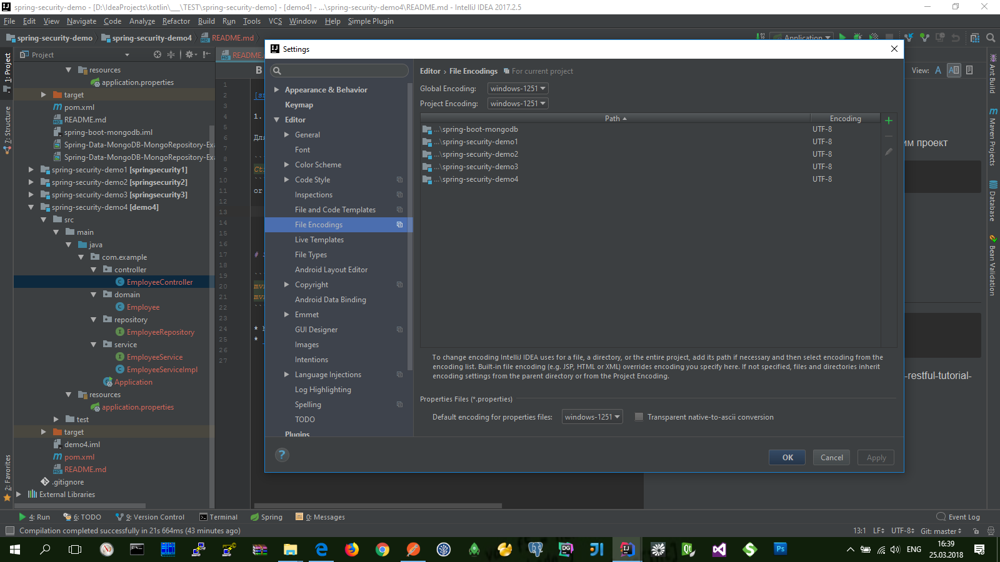

[snag.gy](https://snag.gy)


## [Configuring Encoding for properties Files](https://www.jetbrains.com/help/idea/configuring-encoding-for-properties-files.html)

Для поддержки коддировки русских символов настроим проект

```bash
Ctrl+Alt+S
```
or choose: `File | Settings | Editor | File Encodings` 




## Сначала созданим простой REST-проект с помощью **Spring Boot**

Сюда-же можно добавить загрузку данных по умолчанию в базу данных (в классе-наследнике **ApplicationListener<ContextRefreshedEvent>** ...)

* [Spring Boot + RESTful Tutorial](https://github.com/gustavoponce7/SpringBootRESTfulTutorial)
  **(** https://medium.com/@gustavo.ponce.ch/spring-boot-restful-tutorial-7f0e314242ef **)**
    ```bash
    mvn clean install
    ```

* API нашего REST-проекта:
  * `GET` [http://localhost:8088/api/employee](http://localhost:8088/api/employee)
    ```json
    [
        {
            "id": 1,
            "name": "Gustavo",
            "lastName": "Ponce",
            "active": true
        },
        {
            "id": 2,
            "name": "John",
            "lastName": "Smith",
            "active": true
        },
        {
            "id": 3,
            "name": "Jim ",
            "lastName": "Morrison",
            "active": false
        },
        {
            "id": 4,
            "name": "David",
            "lastName": "Gilmour",
            "active": true
        }
    ]
    ```
  * `GET` [http://localhost:8088/api/employee/1](http://localhost:8088/api/employee/1)
    ```json
    {
        "id": 1,
        "name": "Gustavo",
        "lastName": "Ponce",
        "active": true
    }
    ```

* Специальное (дополнительное) API для мониторинга системы:
  * `GET` [http://localhost:8088/metrics](http://localhost:8088/metrics)
  * `GET` [http://localhost:8088/health](http://localhost:8088/health)


## Подключаем Swagger чтобы сгенерить авто-документацию для нашего API

* подключае зависимости: `io.springfox // springfox-swagger2 / springfox-swagger-ui / springfox-bean-validators`
* описываем конфигурацию в классе `SwaggerConfig`
* `GET` [http://localhost:8088/swagger-ui.html](http://localhost:8088/swagger-ui.html)


