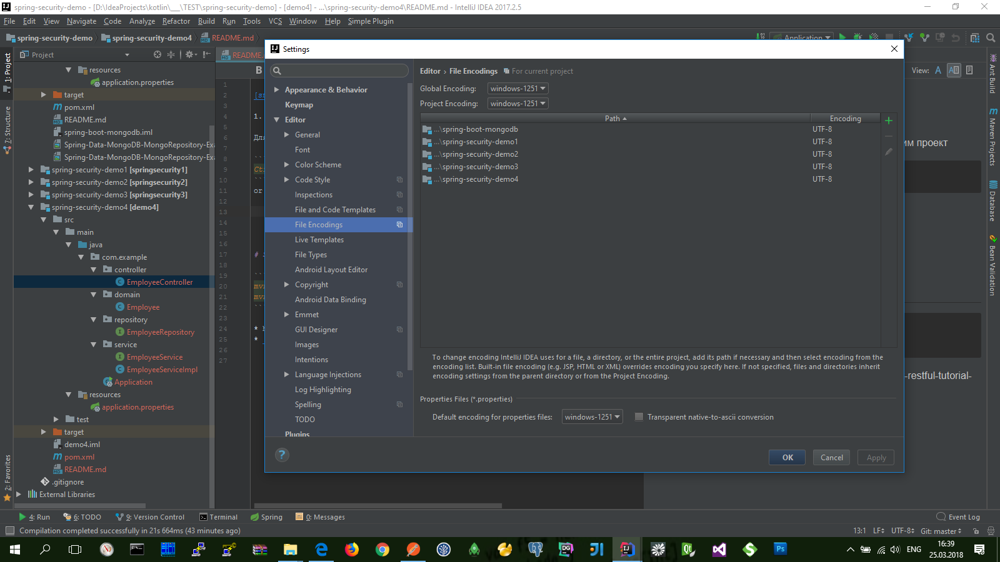

[snag.gy](https://snag.gy)


## [Configuring Encoding for properties Files](https://www.jetbrains.com/help/idea/configuring-encoding-for-properties-files.html)

Для поддержки коддировки русских символов настроим проект

```bash
Ctrl+Alt+S
```
or choose: `File | Settings | Editor | File Encodings` 




## Сначала созданим простой REST-проект с помощью **Spring Boot**

Сюда-же можно добавить загрузку данных по умолчанию в базу данных (в классе-наследнике **ApplicationListener<ContextRefreshedEvent>** ...)

* [Spring Boot + RESTful Tutorial](https://github.com/gustavoponce7/SpringBootRESTfulTutorial)
  **(** https://medium.com/@gustavo.ponce.ch/spring-boot-restful-tutorial-7f0e314242ef **)**
    ```bash
    mvn clean install
    ```

* API нашего REST-проекта:
  * `GET` [http://localhost:8088/api/employee](http://localhost:8088/api/employee)
    ```json
    [
        {
            "id": 1,
            "name": "Gustavo",
            "lastName": "Ponce",
            "active": true
        },
        {
            "id": 2,
            "name": "John",
            "lastName": "Smith",
            "active": true
        },
        {
            "id": 3,
            "name": "Jim ",
            "lastName": "Morrison",
            "active": false
        },
        {
            "id": 4,
            "name": "David",
            "lastName": "Gilmour",
            "active": true
        }
    ]
    ```
  * `GET` [http://localhost:8088/api/employee/1](http://localhost:8088/api/employee/1)
    ```json
    {
        "id": 1,
        "name": "Gustavo",
        "lastName": "Ponce",
        "active": true
    }
    ```

* Специальное (дополнительное) API для мониторинга системы:
  * `GET` [http://localhost:8088/metrics](http://localhost:8088/metrics)
  * `GET` [http://localhost:8088/health](http://localhost:8088/health)


## Подключаем Swagger чтобы сгенерить авто-документацию для нашего API

* подключае зависимости: `io.springfox // springfox-swagger2 / springfox-swagger-ui / springfox-bean-validators`
* описываем конфигурацию в классе `SwaggerConfig`
* `GET` [http://localhost:8088/swagger-ui.html](http://localhost:8088/swagger-ui.html)


## Подключим и настроим простую секюрность в Spring Boot(е)

* https://www.youtube.com/watch?v=Tq9pY8hPjTk

- Подключаем стартер в dependency: `org.springframework.boot / spring-boot-starter-security` + `org.springframework.boot / spring-boot-starter-thymeleaf`

И теперь доступ ко всему API будет закрыт... по умолчанию установлена базовая авторизация

    username: user
    password: <Using default security password> (588f4975-f3c6-4080-88b8-3f99cdc5e69d)

* Теперь нстроим кастомную форму логина:
  * добавим в `resources` **resources\templates** и **resources\public**

- Дальше нужно подключить ресурсы:
  - добавить папку **resources/public** (для статических ресурсов-стилей) и **resources/templates** (для динамических ресурсов-html-страниц ... здесь важно правильно соблюдать HTML-синтаксис)
  - добавить класс-конфигурации (наследник) **WebMvcConfigurerAdapter** и внутри подключить эти ресурсы по именам (это название html-страниц НО без расширения)
  - настроить секюрность в классе (наследник) **WebSecurityConfigurerAdapter**:
    - веб-странички **username** и **password** создаются Spring-Boot(ом) по умолчанию но их можно и переопределить...
    - еще здесь можно переопределить сам **username** и **password** для пользователя...
    - здесь-же можно добавить те рессурсы которые будут открыты для СВОБОДНОГО доступу (например: Swagger...) 

* `POST` [http://localhost:8088/login](http://localhost:8088/login)
    ```properties
    username : user
    password : password
    ```
* `GET` [http://localhost:8088/logout](http://localhost:8088/logout)


### (Help)

https://stackoverflow.com/questions/36697663/circular-view-path-error-spring-boot/41918545

https://stackoverflow.com/questions/45536972/how-add-css-and-js-to-spring-boot-application/45537528

https://github.com/spring-projects/spring-security/issues/4857

https://docs.spring.io/spring-security/site/docs/current/guides/html5/helloworld-boot.html

https://stackoverflow.com/questions/31134333/this-application-has-no-explicit-mapping-for-error


