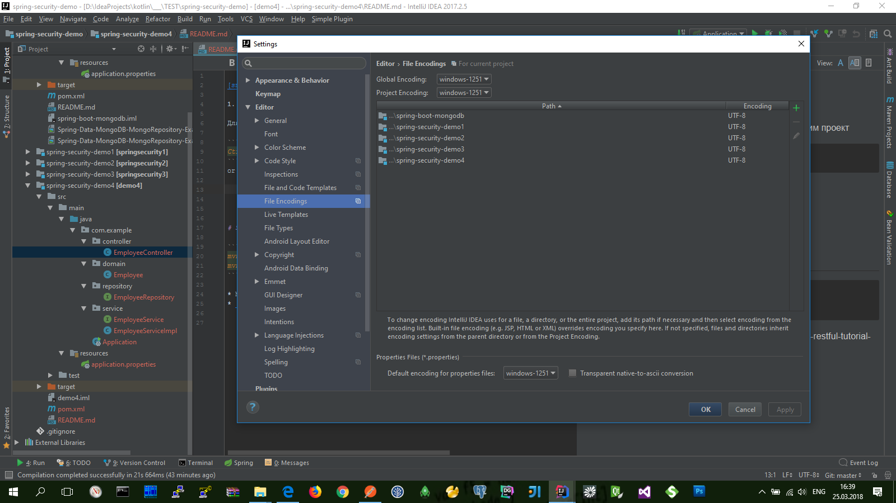

[snag.gy](https://snag.gy)


## [Configuring Encoding for properties Files](https://www.jetbrains.com/help/idea/configuring-encoding-for-properties-files.html)

Для поддержки коддировки русских символов настроим проект

```bash
Ctrl+Alt+S
```
or choose: `File | Settings | Editor | File Encodings` 




## Сначала созданим простой REST-проект с помощью **Spring Boot**

Сюда-же можно добавить загрузку данных по умолчанию в базу данных (в классе-наследнике **ApplicationListener<ContextRefreshedEvent>** ...)

* [Spring Boot + RESTful Tutorial](https://github.com/gustavoponce7/SpringBootRESTfulTutorial)
  **(** https://medium.com/@gustavo.ponce.ch/spring-boot-restful-tutorial-7f0e314242ef **)**
    ```bash
    mvn clean install
    ```

* API нашего REST-проекта:
  * `GET` [http://localhost:8088/api/employee](http://localhost:8088/api/employee)
    ```json
    [
        {
            "id": 1,
            "name": "Gustavo",
            "lastName": "Ponce",
            "active": true
        },
        {
            "id": 2,
            "name": "John",
            "lastName": "Smith",
            "active": true
        },
        {
            "id": 3,
            "name": "Jim ",
            "lastName": "Morrison",
            "active": false
        },
        {
            "id": 4,
            "name": "David",
            "lastName": "Gilmour",
            "active": true
        }
    ]
    ```
  * `GET` [http://localhost:8088/api/employee/1](http://localhost:8088/api/employee/1)
    ```json
    {
        "id": 1,
        "name": "Gustavo",
        "lastName": "Ponce",
        "active": true
    }
    ```

* Специальное (дополнительное) API для мониторинга системы:
  * `GET` [http://localhost:8088/metrics](http://localhost:8088/metrics)
  * `GET` [http://localhost:8088/health](http://localhost:8088/health)


## Подключаем Swagger чтобы сгенерить авто-документацию для нашего API

* подключае зависимости: `io.springfox // springfox-swagger2 / springfox-swagger-ui / springfox-bean-validators`
* описываем конфигурацию в классе `SwaggerConfig`
* `GET` [http://localhost:8088/swagger-ui.html](http://localhost:8088/swagger-ui.html)


## Подключим и настроим простую секюрность в Spring Boot(е)

* https://www.youtube.com/watch?v=Tq9pY8hPjTk

- Подключаем стартер в dependency: `org.springframework.boot / spring-boot-starter-security` + `org.springframework.boot / spring-boot-starter-thymeleaf`

И теперь доступ ко всему API будет закрыт... по умолчанию установлена базовая авторизация

    username: user
    password: <Using default security password> (588f4975-f3c6-4080-88b8-3f99cdc5e69d)

* Теперь нстроим кастомную форму логина:
  * добавим в `resources` **resources\templates** и **resources\public**

- Дальше нужно подключить ресурсы:
  - добавить папку **resources/public** (для статических ресурсов-стилей) и **resources/templates** (для динамических ресурсов-html-страниц ... здесь важно правильно соблюдать HTML-синтаксис)
  - добавить класс-конфигурации (наследник) **WebMvcConfigurerAdapter** и внутри подключить эти ресурсы по именам (это название html-страниц НО без расширения)
  - настроить секюрность в классе (наследник) **WebSecurityConfigurerAdapter**:
    - веб-странички **username** и **password** создаются Spring-Boot(ом) по умолчанию но их можно и переопределить...
    - еще здесь можно переопределить сам **username** и **password** для пользователя...
    - здесь-же можно добавить те рессурсы которые будут открыты для СВОБОДНОГО доступу (например: Swagger...) 

* `POST` [http://localhost:8088/login](http://localhost:8088/login)
    ```properties
    username : user
    password : password
    ```
* `GET` [http://localhost:8088/logout](http://localhost:8088/logout)


### (Help)

https://stackoverflow.com/questions/36697663/circular-view-path-error-spring-boot/41918545

https://stackoverflow.com/questions/45536972/how-add-css-and-js-to-spring-boot-application/45537528

https://github.com/spring-projects/spring-security/issues/4857

https://docs.spring.io/spring-security/site/docs/current/guides/html5/helloworld-boot.html

https://stackoverflow.com/questions/31134333/this-application-has-no-explicit-mapping-for-error


=====

http://www.baeldung.com/spring-security-two-factor-authentication-with-soft-token

https://github.com/Home-SignUp/spring-security-demo/tree/master/spring-security-demo4/src/main/java/com/example/config

https://github.com/J2EE-Secirity/spring-security-registration/tree/master/src/main/java/org/baeldung/config

https://github.com/J2EE-Secirity/TOTP-spring

>> https://www.javacodegeeks.com/2015/10/spring-boot-oauth2-security.html
   https://github.com/rajithd/spring-boot-oauth2
   https://www.youtube.com/watch?v=0pD7YeTAUkk

>> http://www.swisspush.org/security/2016/10/17/oauth2-in-depth-introduction-for-enterprises
   https://github.com/exteso/oauth2-step-by-step

>> http://projects.spring.io/spring-security-oauth/docs/oauth2.html

>> https://jugbd.org/2017/09/19/implementing-oauth2-spring-boot-spring-security/

https://www.youtube.com/watch?v=Tq9pY8hPjTk

https://github.com/esurovtsev/spring-security-demo/tree/003-custom-user-details-service/src/main

https://github.com/khoubyari/spring-boot-rest-example/tree/master/src/main/java/com/khoubyari/example/dao/jpa

https://github.com/spring-guides/tut-spring-security-and-angular-js/issues/121

+++++

>> (Spring Boot ** application.yaml) https://www.mkyong.com/spring-boot/spring-boot-profile-based-properties-and-yaml-example/
                                     https://github.com/khoubyari/spring-boot-rest-example/blob/master/src/main/resources/application.yml
                                     https://www.mkyong.com/spring-boot/spring-boot-configurationproperties-example/
                                     http://www.baeldung.com/spring-yaml

(spring boot oauth2)

>> https://vitalflux.com/tutorials-spring-security-oauth2-rest-api/
   https://github.com/tinmegali/Oauth2-Stateless-Authentication-with-Spring-and-JWT-Token/tree/master/src/main/java/com/tinmegali/security
   https://github.com/cpapidas/Spring-Boot-OAuth2-JWT-MySQL
>> http://sivatechlab.com/secure-rest-api-using-spring-security-oauth2-part-4/
   https://github.com/sivaappavu/crm-oauth2
   http://sivatechlab.com/secure-rest-api-using-spring-security-oauth2-part-3/
   http://sivatechlab.com/secure-rest-api-using-spring-security-oauth2/
>> https://dzone.com/articles/secure-spring-rest-with-spring-security-and-oauth2
   https://github.com/adamzareba/company-structure-spring-security-oauth2-authorities

https://blogs.perficient.com/delivery/blog/2018/02/07/securing-rest-service-spring-security-oauth2-method/
https://github.com/spring-projects/spring-security-oauth/blob/master/samples/oauth2/sparklr/src/main/java/org/springframework/security/oauth/examples/sparklr/oauth/SparklrUserApprovalHandler.java
http://www.littlebigextra.com/spring-boot-oauth2-tutorial-for-authorizing-through-facebook-google-linkedin-and-twitter/
http://dku.bplaced.net/?p=182
>> https://code.i-harness.com/ru/q/1c5b5a1
http://www.java-allandsundry.com/2017/02/using-uaa-oauth2-authorization-server.html
https://github.com/bijukunjummen/oauth-uaa-sample
http://www.javainuse.com/spring/spring-boot-oauth-authorization-code
http://blog.monkey.codes/how-to-use-jwt-and-oauth-with-spring-boot/
http://mmkay.pl/2017/03/19/spring-boot-saving-oauth2-login-data-in-db-using-principalextractor/
https://habrahabr.ru/company/nixsolutions/blog/272529/
https://javadeveloperzone.com/spring-boot/spring-boot-oauth2-jdbc-token-store-example/
>> https://github.com/jeevan-patil/api-design
https://www.tristanperry.com/java8/spring/2017/12/23/java8-spring-cloud-microservice-demo.html
https://www.bountysource.com/issues/29663709-refactor-the-whole-spring-security-configuration-to-use-oauth2-only
